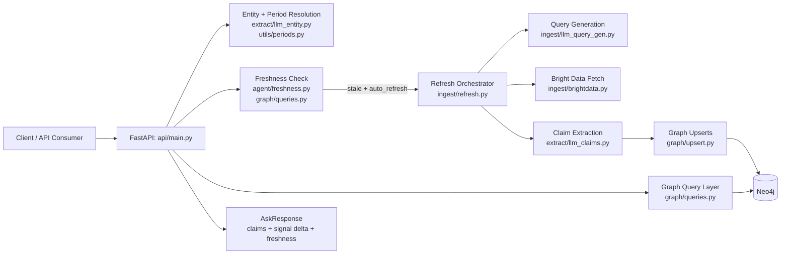
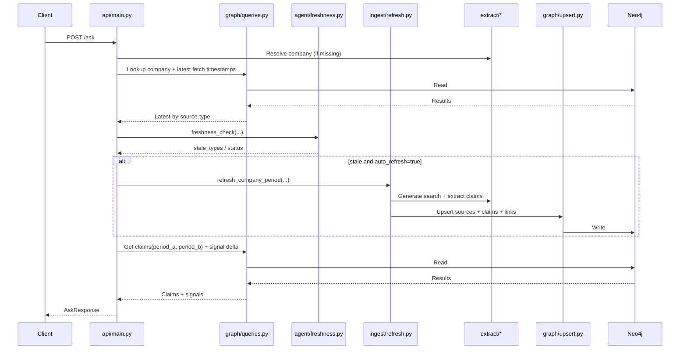

# PulseGraph Architecture

This document explains how PulseGraph is put together so new contributors can quickly understand the system and navigate the codebase.

## 1) System purpose

PulseGraph turns fresh web information into a graph-backed answering system for company/event questions.

At a high level, it does four things:
1. Ingests and refreshes source content from the web.
2. Extracts structured claims from those sources.
3. Stores and updates claims/signals in Neo4j.
4. Serves comparison answers through the API.

---

## 2) Architecture in one view

**Entry point**
- `api/main.py` receives requests and orchestrates all major steps.

**Core subsystems**
- `ingest/` discovers and fetches external sources.
- `extract/` converts unstructured text into structured entities/claims.
- `graph/` writes and queries the knowledge graph.
- `agent/` checks freshness and drives refresh behavior.
- `utils/` and `models/` provide shared period and type registries.

Think of PulseGraph as:
- API orchestration layer
- Knowledge graph data layer
- Refresh/extraction pipeline

### System diagram

---

## 3) Runtime request flow (`POST /ask`)

Primary route: `api/main.py`

1. Validate request payload (`question`, optional `company`, optional periods, event/signal settings).
2. Resolve company:
   - Use provided `company`, or
   - Infer from question with `extract/llm_entity.py`.
3. Resolve periods:
   - Use request values when provided.
   - Otherwise compute defaults with `utils/periods.py`.
4. Run freshness check:
   - Read latest fetch timestamps via `graph/queries.py`.
   - Evaluate staleness via `agent/freshness.py`.
5. Optional refresh (`auto_refresh=true`):
   - Trigger `ingest/refresh.py` for stale source types.
6. Query graph for response:
   - Claims + source context for period A and B.
   - Signal values and delta for period A vs B.
7. Return response with:
   - Company info
   - Compared periods
   - Claims for both periods
   - Signal delta
   - Freshness status

### Request sequence diagram

---

## 4) Refresh pipeline flow (stale data path)

Main orchestrator: `ingest/refresh.py`

1. Generate targeted search query with `ingest/llm_query_gen.py`.
2. Discover URLs from Bright Data SERP (`ingest/brightdata.py`).
3. Fetch readable content with Bright Data Unlocker (`ingest/brightdata.py`).
4. Normalize each page to `SourceDoc` (`extract/contracts.py`).
5. Upsert source nodes + links into graph (`graph/upsert.py`).
6. Extract structured claims (`extract/llm_claims.py`).
7. Upsert claims and relationships into graph (`graph/upsert.py`).

This path keeps graph answers aligned with source freshness policies.

---

## 5) Data model (Neo4j)

Core node types:
- `Company`
- `Event`
- `Source`
- `Claim`
- `Signal`

Important relationships:
- `(:Company)-[:HAS_EVENT]->(:Event)`
- `(:Event)-[:HAS_CLAIM]->(:Claim)`
- `(:Source)-[:SUPPORTS]->(:Claim)`
- `(:Claim)-[:ABOUT]->(:Company)`
- `(:Signal)-[:ABOUT]->(:Company)`
- `(:Signal)-[:IN_WINDOW]->(:Event)`

Schema setup and constraints live in `graph/schema.py`.

---

## 6) Module map (what to read and why)

### API orchestration
- `api/main.py`
  - Best first file for understanding end-to-end behavior.

### Graph operations
- `graph/db.py` – driver creation from env vars.
- `graph/schema.py` – constraints/indexes.
- `graph/upsert.py` – idempotent write paths.
- `graph/queries.py` – read patterns for claims/signals/freshness.

### Ingestion and extraction
- `ingest/refresh.py` – stale-data refresh workflow.
- `ingest/brightdata.py` – external web discovery/fetching.
- `ingest/llm_query_gen.py` – context-aware search query generation.
- `extract/llm_entity.py` – company extraction from question text.
- `extract/llm_claims.py` – structured claim extraction from source text.
- `extract/contracts.py` + `extract/schemas.py` – shared data contracts.

### Cross-cutting support
- `agent/freshness.py` – source-type freshness thresholds and checks.
- `utils/periods.py` – dynamic quarter/period defaulting.
- `models/registry.py` – supported event and signal type registry.

---

## 7) Configuration and external dependencies

### Local services
- Neo4j is required for graph storage and queries.

### External APIs
- OpenAI API is used for:
  - Company extraction
  - Query generation
  - Claim extraction
- Bright Data APIs are used for:
  - SERP discovery
  - Page unlock/fetch

### Key environment variables
- `NEO4J_URI`, `NEO4J_USER`, `NEO4J_PASSWORD`
- `OPENAI_API_KEY`
- `BRIGHTDATA_API_KEY`, `BRIGHTDATA_SERP_ZONE`, `BRIGHTDATA_UNLOCKER_ZONE`

---

## 8) How to explore the architecture quickly

Recommended ramp-up sequence:
1. Read `api/main.py` for request lifecycle.
2. Read `graph/upsert.py` and `graph/queries.py` for storage/query patterns.
3. Read `ingest/refresh.py` for the refresh pipeline.
4. Read `extract/contracts.py` and `extract/schemas.py` for data contracts.
5. Read `agent/freshness.py` and `utils/periods.py` for policy/default logic.

Then run:
- `python3 scripts/seed_expanded.py`
- `uv run fastapi dev api/main.py`
- Test `POST /ask` in docs (`/docs`).

### Engineer quick-start checklist

Use this checklist when onboarding or validating a fresh environment:

1. Confirm environment variables are set (`NEO4J_*`, `OPENAI_API_KEY`, Bright Data keys if refresh is needed).
2. Seed baseline graph data (`scripts/seed_expanded.py`).
3. Start API and validate `GET /event-types` and `GET /signal-types`.
4. Run one `POST /ask` with explicit company + periods.
5. Run one `POST /ask` without periods to confirm dynamic defaults.
6. Run one stale-data scenario with `auto_refresh=true` to validate refresh path.
7. Verify response contracts in `api/main.py` models still match expected payload shape.

---

## 9) Related docs

- `README.md` – setup and quick start.
- `USAGE_GUIDE.md` – practical API usage patterns.
- `DYNAMIC_PERIODS.md` – period defaulting details.
- `tests/README.md` – test coverage and scripts.

---

## 10) Extension points

Most common architecture-level changes:
- Add event/signal families in `models/registry.py`.
- Expand extraction schema in `extract/schemas.py`.
- Add refresh strategies in `ingest/refresh.py`.
- Add new seed scenarios in `scripts/`.

When making larger changes, keep contracts in `extract/contracts.py` stable first, then evolve ingest/query behavior around those contracts.

---

## 11) Generalizing to new domains (beyond company earnings)

PulseGraph’s architecture is reusable if you treat it as a **domain-agnostic graph extraction pipeline**.

Reusable parts:
- Ingestion/fetch orchestration (`ingest/`)
- Structured extraction contracts (`extract/`)
- Idempotent graph write/read patterns (`graph/`)
- Freshness policy layer (`agent/freshness.py`)

Domain-specific parts you should replace or extend:
- Entity extractor prompt/schema (`extract/llm_entity.py`)
- Claim schema taxonomy (`extract/schemas.py`, `extract/contracts.py`)
- Event/signal registry (`models/registry.py`)
- Query generation strategy (`ingest/llm_query_gen.py`)

---

## 12) Example expansion: sports game predictions

This is a practical blueprint for adapting PulseGraph to sports outcomes (e.g., winner probability, spread, totals).

### Context target (your use case)

Primary competitions:
- FIFA World Cup
- UEFA Champions League
- Additional club and international competitions over time

Primary product outcome:
- Predict match `win_probability` with transparent evidence so users can inspect *why* the model made that prediction.

Key inputs to support from day one:
- Team rankings (FIFA/ELO/competition table position)
- Analyst sentiment (expert previews, pundit analysis, trusted media)
- Team form (recent results, goals for/against, xG where available)
- Availability (injuries, suspensions, expected lineups)
- Context (home/away, neutral venue, travel/rest, weather, match importance)
- Market context (odds and line movement as optional feature)

### A. New domain entities

Map current graph concepts to sports concepts:

- `Company` → `Team` (or `Player` for individual sports)
- `Event` → `Game` (scheduled matchup, date/time, season/week)
- `Claim` → `SignalClaim` (injury update, lineup change, weather, form)
- `Signal` → `PredictionSignal` (win probability, expected goals/points, confidence)
- `Source` stays `Source`

Recommended additional node labels/fields:
- `League` (NBA/NFL/EPL/etc.)
- `Season` / `Week`
- `Game` fields: home team, away team, venue, start time

### B. Ingestion changes

Add source adapters for:
- official injury reports
- team news and beat reporters
- odds/bookmaker lines
- historical game logs and advanced stats

Keep the same orchestration shape in `ingest/refresh.py`, but route through sports-specific query generation and extraction prompts.

### C. Extraction and schema changes

Introduce sports-oriented claim types, for example:
- `injury_status`
- `lineup_change`
- `rest_advantage`
- `travel_fatigue`
- `weather_impact`
- `market_line_move`

Add sports signal types in `models/registry.py`, for example:
- `win_probability`
- `spread_edge`
- `total_points_projection`
- `upset_risk`

Also add soccer-specific signal families:
- `rank_strength_delta` (difference in ranking strength between teams)
- `analyst_sentiment_score` (aggregated expert sentiment by team)
- `form_strength_score` (recent form trend)
- `availability_impact_score` (injury/suspension impact)

### D. API evolution

Add a domain-aware endpoint while preserving existing `/ask` behavior:
- `POST /predict-game`
   - Inputs: league, home team, away team, game date, market line (optional)
   - Output: predicted winner, probability, confidence drivers, supporting claims

Keep response structure explainable by including top supporting claims/sources.

Recommended explainable response shape for soccer:
- `prediction`: `{home_win, draw, away_win}` probabilities
- `top_factors`: ranked list of feature contributions (positive/negative)
- `evidence`: claims with source links, timestamps, and confidence
- `freshness`: how recent each high-impact source is
- `model_version`: identifier for reproducibility

### E. Freshness policy for sports

Sports data freshness windows are shorter near game time. Suggested policy:
- injuries/lineups: refresh every 30-120 minutes on game day
- odds movements: refresh every 15-60 minutes close to kickoff/tipoff
- long-horizon team stats: refresh daily

Implement this by extending source-type thresholds in `agent/freshness.py`.

### F. Evaluation and safety checks

For prediction scenarios, add explicit evaluation loops:
- backtest by season/week
- calibration checks (probability reliability)
- drift detection by league/season
- confidence thresholding (abstain when evidence is weak)

This keeps outputs useful and reduces overconfident predictions.

---

## 13) Suggested implementation plan for sports support

1. Create domain registry entries for sports event/signal types.
2. Add sports extraction schema + prompts with strict structured output.
3. Add sports seed script with a small league/team/game sample.
4. Add graph query helpers for game-level retrieval and comparison.
5. Add `POST /predict-game` endpoint behind a feature flag.
6. Add tests for extraction, freshness, and prediction response shape.

Start small with one league and one prediction target (`win_probability`), then expand.

---

## 14) Detailed task breakdown (start to finish)

Use this as the execution checklist to deliver sports prediction support end-to-end.

### Phase 0 — Scope and success criteria

**Goal:** lock the first deliverable so implementation stays focused.

Tasks:
1. Pick one league for MVP (example: NBA).
2. Pick one prediction target (example: `win_probability`).
3. Define response contract for MVP (`winner`, `probability`, `confidence`, top drivers).
4. Define minimum model quality gates (for example: calibration error threshold).
5. Decide refresh SLA by data source type (injuries, odds, stats).
6. Decide soccer MVP scope explicitly (for example: UEFA Champions League knockout stage only).
7. Define competition-specific outcomes (`home_win`, `draw`, `away_win`) for football matches.

Exit criteria:
- Written MVP scope, API contract, and quality gates approved by team.

### Phase 1 — Domain model and schema foundation

**Goal:** create the data model needed for sports reasoning.

Tasks:
1. Add sports event/signal entries in `models/registry.py`.
2. Extend graph schema to support `League`, `Team`, and `Game` concepts.
3. Define canonical game identity strategy (league + season + game_id/date + teams).
4. Add sports claim schema in `extract/schemas.py` and `extract/contracts.py`.
5. Add migration/compatibility notes so existing company flow remains intact.
6. Add ranking and sentiment entities/edges (for example, `(:Team)-[:HAS_RANKING]->(:RankingSnapshot)`).

Exit criteria:
- New node/relationship patterns are queryable and idempotent.
- Existing `/ask` behavior is unchanged.

### Phase 2 — Ingestion adapters and source normalization

**Goal:** ingest sports data from multiple source categories.

Tasks:
1. Implement source adapters for injuries, odds, team news, and game stats.
2. Normalize all incoming payloads into `SourceDoc`-compatible records.
3. Add provenance metadata fields (league, season, team aliases, source reliability).
4. Add deduplication rules for repeated source updates.
5. Add ingest error handling + retry logic for unstable sources.
6. Add ranking-table and analyst-opinion ingestors as first-class sources.

Exit criteria:
- Can ingest at least one upcoming game with all required source categories.
- Each stored claim is traceable to a source URL and timestamp.

### Phase 3 — Extraction and feature construction

**Goal:** convert text and source feeds into structured prediction features.

Tasks:
1. Add sports extraction prompts in `extract/llm_claims.py`.
2. Add sports entity extraction updates in `extract/llm_entity.py` (team/game context).
3. Implement claim-to-feature transformation (injuries, rest, travel, line movement).
4. Create computed `PredictionSignal` upserts in `graph/upsert.py`.
5. Add confidence scoring and evidence requirements for each extracted claim.
6. Add dedicated transformations for ranking strength and analyst sentiment aggregation.

Exit criteria:
- For a seeded game, graph contains structured claims + computed prediction signals.

### Phase 4 — Query and API surface

**Goal:** expose sports predictions through stable API endpoints.

Tasks:
1. Add game/prediction query helpers in `graph/queries.py`.
2. Add `POST /predict-game` request/response models in `api/main.py`.
3. Support optional explanation depth (`summary` vs `detailed`) in response.
4. Add fallback behavior when evidence is insufficient (abstain or low-confidence).
5. Add endpoint docs and example calls.
6. Add probability-triplet outputs for football (`home_win`, `draw`, `away_win`).
7. Add factor attribution block so users can inspect what drove the prediction.

Exit criteria:
- API returns prediction + supporting claims + freshness metadata for target game.

### Phase 5 — Freshness and scheduling

**Goal:** ensure predictions stay current as game conditions change.

Tasks:
1. Extend `agent/freshness.py` with sports-specific thresholds.
2. Add pre-game refresh cadence logic (faster near tipoff/kickoff).
3. Add post-event freeze behavior to prevent late data drift in evaluation.
4. Add refresh observability (last update by source type).
5. Validate `auto_refresh` behavior for sports endpoints.

Exit criteria:
- Freshness checks correctly flag stale injuries/odds and trigger refresh.

### Phase 6 — Evaluation and model governance

**Goal:** verify prediction quality and prevent overconfident outputs.

Tasks:
1. Build backtest harness by week/season.
2. Add calibration metrics (Brier/log loss or reliability buckets).
3. Add drift checks by league/season segments.
4. Define confidence-to-action policy (when to abstain).
5. Create regression benchmark dataset for CI.
6. Track explainability quality: percentage of predictions with sufficient, recent supporting evidence.

Exit criteria:
- Meets pre-defined quality gates from Phase 0.
- Produces stable results across repeated runs.

### Phase 7 — Testing, hardening, and release

**Goal:** productionize without breaking current PulseGraph behavior.

Tasks:
1. Add tests:
   - schema validation tests
   - ingestion adapter tests
   - prediction endpoint contract tests
   - freshness policy tests
2. Add sports seed script for deterministic local verification.
3. Add feature flag for sports APIs.
4. Run shadow mode (predictions generated but not user-exposed) for validation window.
5. Roll out incrementally (internal users → limited external users → full release).

Exit criteria:
- All tests pass.
- Existing company intelligence endpoints remain stable.
- Sports prediction endpoints meet reliability and latency targets.

---

## 15) Suggested ticket structure (engineering backlog)

Create tickets in this order to reduce rework:

1. `SPORT-001`: MVP scope + success criteria doc
2. `SPORT-002`: Registry + schema updates
3. `SPORT-003`: Graph model and upsert/query primitives
4. `SPORT-004`: Ingestion adapters (injuries + odds first)
5. `SPORT-005`: Sports extraction schema + prompts
6. `SPORT-006`: Feature construction + prediction signal upserts
7. `SPORT-007`: `POST /predict-game` endpoint
8. `SPORT-008`: Sports freshness thresholds + refresh cadence
9. `SPORT-009`: Backtest + calibration harness
10. `SPORT-010`: End-to-end tests + shadow rollout

Each ticket should include:
- scope
- interfaces changed
- test plan
- rollback plan

---

## 16) Soccer-focused MVP backlog (recommended)

If your near-term goal is FIFA/UEFA match prediction with explainability, execute this narrowed backlog first:

1. `SOCCER-001`: UEFA/FIFA competition model + game identity design
2. `SOCCER-002`: Ranking snapshot ingestion (FIFA/ELO/table position)
3. `SOCCER-003`: Analyst sentiment ingestion + trust-weighting rules
4. `SOCCER-004`: Injury/suspension + probable lineup ingestion
5. `SOCCER-005`: Soccer claim schema + extraction prompts
6. `SOCCER-006`: Feature builder (`rank_strength_delta`, `form_strength`, `availability_impact`)
7. `SOCCER-007`: `POST /predict-game` with `{home_win, draw, away_win}`
8. `SOCCER-008`: Explanation payload (`top_factors`, `evidence`, `freshness`, `model_version`)
9. `SOCCER-009`: Backtest on last 1-2 seasons of Champions League/World Cup qualifiers
10. `SOCCER-010`: Shadow deployment + calibration tuning before public release

MVP acceptance criteria:
- Prediction endpoint returns calibrated three-way probabilities.
- Every prediction includes at least 3 high-confidence supporting factors with source evidence.
- Evidence timestamps meet freshness policy for pre-match windows.
